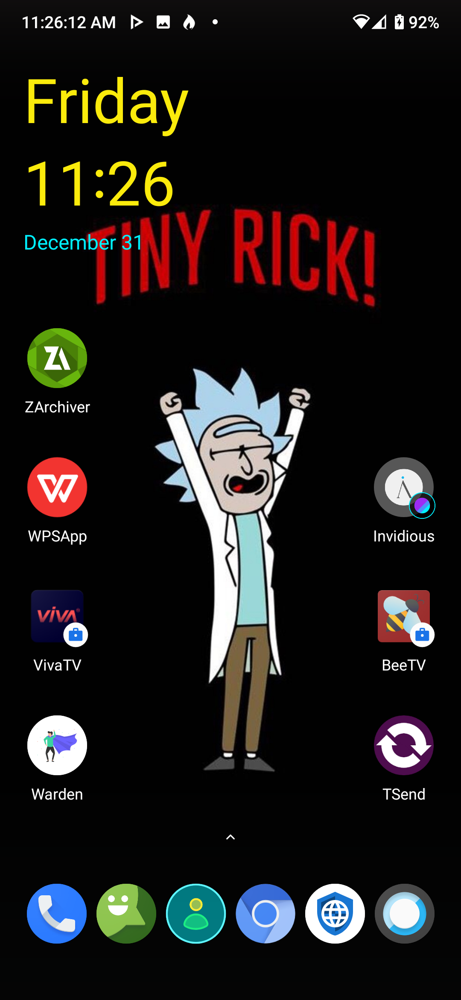
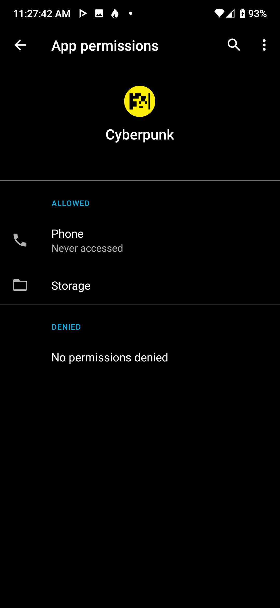

# AndroidCyberpankIcons
Icon pack and charging animation inspired by OnePlus 8T Cyberpunk 2077 Limited Edition  
## What is included
Charging animattions,icons and wdget
## how to build
to build you need to run
```./gradlew build```
app will be in /app/build/outputs/apk
## how is looks like



## permissions
For using app you need to enable



## note
charge animation works only in some devices
